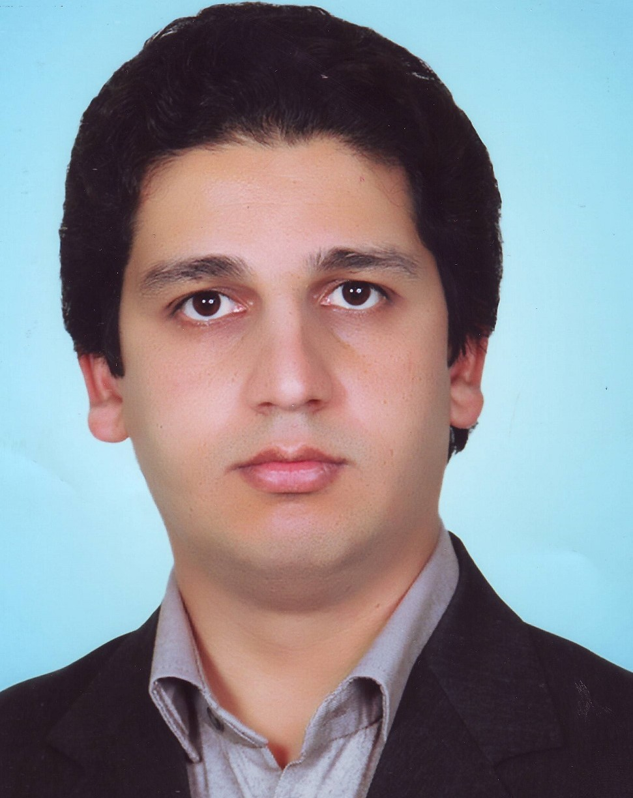

<!-- V 0.0.2 -->

  <link href="media/kjhealy-screen.rtl.css" type="text/css" rel="stylesheet" media="screen">
  <link href="media/kjhealy-print.rtl.css" type="text/css" rel="stylesheet" media="print">

# اسماعیل ذکایی

  <a target="_blank" href="mailto:zekaee.esmaeel@gmail.com">Gmail</a>
   |  <a target="_blank" href="https://www.linkedin.com/in/zekaee-esmaeel-37474aab/">LinkedIn</a> | 
   <a target="_blank" href="https://t.me/Izmaeilz">Telegram</a>
   |
   <a target="_blank" href="https://github.com/EsmaeelZekaee/Resume">
   Github</a>

  

   <a target="_blank" href="tel:+989371217979">9371217979</a>

## معرفی
من متولد 1362 هستم،  18 سالگی به برنامه‌نویسی علاقه‌مند شدم. در دانشگاه وارد رشته ریاضی شودم و کار‌های پژوهشی انجام دادم که انجام آن‌ها مستلزم آشنایی با برنامه‌نوسی و حل مسائل با استفاده از کامپیوتر بود. این تجربه‌ها در درک بهتر  از حل مسائل و طراحی و تولید الگوریتم‌های کامپیوتری کمک بزرگی به من کرد. من با مدرک کاشناسی ارشد در رشته گراف و ترکیبیات فارغ التحصیل شدم.

## هدف شغلی

به دنبال یک موقعیت شغلی در یک تیم حرفه‌ای برنامه‌نویسی هستم تا بتوانم از دانش خود در زمینه‌های طراحی، توسعه و برنامه‌نویسی نرم‌افزار‌های مبتنی بر وب استفاده کنم و باعث پیشترفت در کار تیم و درآمدزایی شرکت شوم.

## تخصص‌ها

### کارهای حرفه‌ای
برنامه‌نویس  .Net Framework (C#) از سال 1385،
ASP.NET MVC, Restful Web API, ASP.Net Core,
Entity Framwork, JavaScript, TypeScript,
AngularJs, JQuery, HTML, CSS, LESS, SASS,
T4, Windows Form Application, WFP,
Java, Android

### تجربه‌کاری
Visual Basic, C/C++, Arduino,
Parallel Programming (OpenPM), Matlab, Fortan

## زمینه‌های موردعلاقه برای مطالعه
علوم کامپیوتر، ریاضیات و الکترونیک
## تحصیلات

`1387-1391`
__ریاضی کاربردی__ دانشگاه حکیم سبزواری

`1391-1393`
__گراف و ترکیبیات، ریاضی کاربردی__ دانشگاه صنعتی شاهرود

## سوابق کاری

`1384-1385`
__واحد آی‌تی__, 
شرکت فولاد و پروفیل صفاطوس، مشهد-فریمان
`1393-1394`

__مدیر واحد IT__, شرکت دمیکو لویزان
`1393-1397`

__مدیر آی‌تی__, مدیر واحد آی‌تی در انتشارات مدرسان شریف  
`1397-1398`
__مدیر پروژه__, شرکت پیوند گستر پردیس

## پروژه‌ها

`1397-1398`
تولید پلاگین و توسعه نرم‌افزار فروشگاه‌ساز بر پایه ناپ‌کامرس

`1397-1398`
راه اندازی سایت‌های فروشگاهی متعدد

`1396-1397` 
طراحی و تولید نرم‌افزار آزمون‌ساز مدرسان شریف برپایه AngularJs

`1396` 
طراحی و توسعه نرم‌افزار فروشگاهی (پنل مدیریتی) برپایه AngularJS

`1395` 
طراحی و تولید نرم‌افزار مدیریت محتوای یک سایت خبری

## کنفرانس‌ها

`1391`
**قدیر. صادقی, اسماعیل ذکایی.**, **تولید توپولوژی‌های موجود بر روی یک مجموعه متناهی**, 42امین کنفرانس ریاضی کشور رفسنجان

 \newpage

## مقالات

`2011`
***A. A. Arefijamaal, E. Zekaee***, **Signal and image processing by alternate dual Gabor frames,** Seminar on Banach spaces and Banach algebras, Damghan University, Damghan, Iran.

`2013`
***A. A. Arefijamaal, E. Zekaee***, **An infinite number of dual Gabor frames and some applications** 1st Seminar on Harmonic analysis and applications, Isfahan University of Technology, Isfahan, Iran. 

`2013`
 ***A. A. Arefijamaal , E. Zekaee***, **Signal processing by alternate dual Gabor frames**, App. Comput. Harmon. Anal. 35 535-540

`2015`
***Gh. Sadeghi, A. Arefijamaal, E. Zekaee***, Construction of all topologies and algebras on finite sets, Acta Universitatis Apulensis, 41 1-9.

`2016`
***A. Arefijamaal, E. Zekaee***, **Image processing by alternate dual Gabor frames**, Bull. Iranian Math. Soc., 42 1305-1314

  
